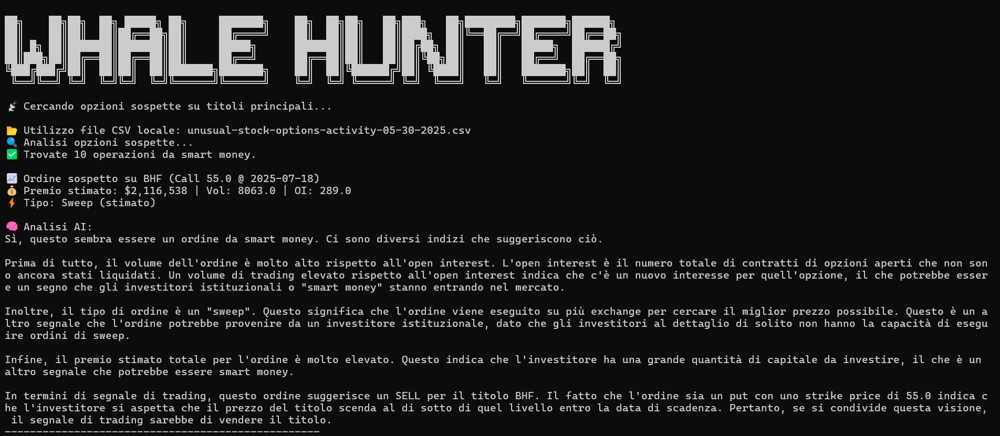

## 📘 Whale Hunter — Smart Money Options Monitor

[https://chatgpt.com/share/68396729-4c5c-8011-ac6f-54bdb95ff2f2](https://chatgpt.com/share/68396729-4c5c-8011-ac6f-54bdb95ff2f2)

### 📊 Monitora automaticamente le opzioni call sospette su titoli principali (tipo Sweep) e interpreta i flussi con OpenAI.


---

### 🚀 Funzionalità

* ✅ Login e scraping automatizzato da sito pubblico gratuito (**Barchart**) con **Playwright**
* 📥 Download e analisi del file **CSV** delle opzioni insolite
* 📈 Rilevamento opzioni call con:

  * Tipo ordine: **Sweep**
  * **Premio ≥ \$500k**
  * Volume > Open Interest
  * Scadenza entro 90 giorni
* 🤖 Analisi automatica con **OpenAI GPT-4**
* 🔐 Sicurezza credenziali e API tramite file `.env`
* 📊 Analisi comportamentale dei flussi (hedging, speculazione, insider)
* 🧠 Riconoscimento pattern multipli su stesso ticker e strike
* 🗂️ Normalizzazione automatica del file CSV in formato compatibile con LLM
* 🖼️ Output visivo delle analisi con esempi (vedi sotto ⬇️)

---



## 🖥️ Requisiti

* Python **3.9+**
* Browser Chromium (gestito automaticamente da Playwright)
* Connessione Internet

---

## 🔧 Setup su Windows

### 1. Clona o scarica il progetto

```bash
git clone https://github.com/antonio-backend-projects/whale-options-orders
cd whale-options-orders
````

### 2. Crea un ambiente virtuale

```bash
python -m venv venv
venv\Scripts\activate
```

### 3. Installa le dipendenze

```bash
pip install -r requirements.txt
playwright install
```

---

### 4. Crea il file `.env` nella root del progetto

```
OPENAI_API_KEY=sk-xxxxxxxxxxxxxxxxxxxxxxxxxxxxxxxxxxxxxxxx
BARCHART_USER=la-tua-email-registrata
BARCHART_PASSWORD=la-tua-password
```

> ⚠️ **Non condividere mai la tua chiave OpenAI o credenziali Barchart.**

---

### 5. Avvia lo script

```bash
python main.py
```

---

## 📂 Struttura del progetto

```
whale-options-orders/
│
├── .env                   ← credenziali e chiavi API
├── main.py                ← script principale
├── requirements.txt       ← dipendenze Python
├── README.md              ← questo file
├── downloads/             ← CSV scaricati da Barchart
├── images/                ← immagini interfaccia ed esempi
└── utils/
    ├── scraper.py         ← scraping + download CSV da Barchart
    └── gpt_analysis.py    ← analisi flussi con OpenAI GPT-4
```

---

## ✅ Esempio di output

```
📡 Cercando opzioni sospette su titoli principali...

📈 Ordine sospetto su AAPL (Call 200 @ Aug 16, 2025)
💰 Premio: $1,050,000 | Vol: 3,400 | OI: 2,100
⚡ Tipo: Sweep

🧠 Analisi AI:
Questo ordine mostra un'alta probabilità di movimento istituzionale...
--------------------------------------------------
```


---

## 📌 Personalizzazioni future (facoltative)

* Esportazione degli ordini in CSV
* Dashboard web in **Dash**
* Notifiche **Telegram** o **email**
* Filtro per settore (es. solo tech, solo energy)
* Modalità cron (esecuzione automatica ogni ora)
* 🧩 Integrazione con voce AI per output vocali live
* 🔔 Alert automatici per rotture tecniche e breakout su titoli seguiti

---

## ❓ Domande frequenti

**🟠 Non vedo dati?**
È possibile che in quel momento non ci siano sweep validi secondo i filtri. Riprova più tardi.

**🔴 Errore da OpenAI?**
Controlla la chiave `.env` e che tu abbia credito disponibile:
[https://platform.openai.com/account/api-keys](https://platform.openai.com/account/api-keys)

**🧭 Il login a Barchart fallisce?**
Verifica che email e password siano corrette e che non sia richiesto un CAPTCHA (Playwright non può bypassarlo).

---

## 👨‍💻 Autore

Script generato con ❤️ da **Antonio Trento** — Open Source Intelligence applicata al flusso opzioni.

